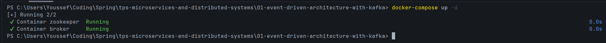
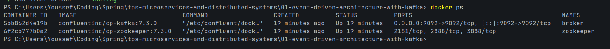
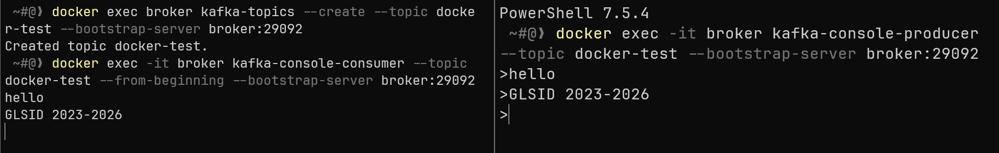
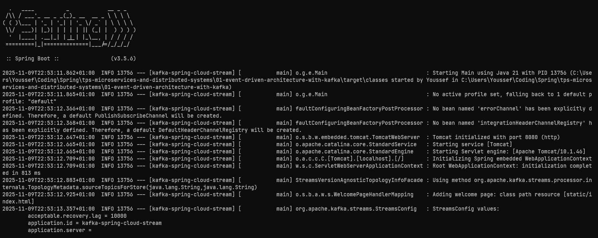
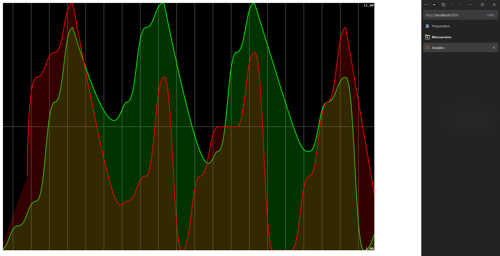
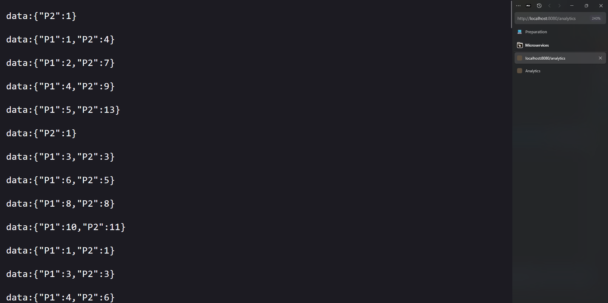

# Practical Activity N°1 : Event-Driven Architecture with Kafka

## 1. Docker Kafka Setup

### Docker Compose Configuration
```yaml
# compose.yml
version: '3.8'
services:
  zookeeper:
    image: confluentinc/cp-zookeeper:7.4.0
    hostname: zookeeper
    container_name: zookeeper
    ports:
      - "2181:2181"
    environment:
      ZOOKEEPER_CLIENT_PORT: 2181
      ZOOKEEPER_TICK_TIME: 2000

  broker:
    image: confluentinc/cp-kafka:7.4.0
    hostname: broker
    container_name: broker
    depends_on:
      - zookeeper
    ports:
      - "29092:29092"
      - "9092:9092"
    environment:
      KAFKA_BROKER_ID: 1
      KAFKA_ZOOKEEPER_CONNECT: 'zookeeper:2181'
      KAFKA_LISTENER_SECURITY_PROTOCOL_MAP: PLAINTEXT:PLAINTEXT,PLAINTEXT_HOST:PLAINTEXT
      KAFKA_ADVERTISED_LISTENERS: PLAINTEXT://broker:29092,PLAINTEXT_HOST://localhost:9092
      KAFKA_OFFSETS_TOPIC_REPLICATION_FACTOR: 1
```

### Running Docker Containers
```bash
# Start containers
docker-compose up -d
```


```bash
# Verify containers
docker ps
```


### Testing with Docker
```cmd
# Create topic
docker exec broker kafka-topics --create --topic docker-test --bootstrap-server broker:29092

# Consumer (terminal 1)
docker exec -it broker kafka-console-consumer --topic docker-test --from-beginning --bootstrap-server broker:29092

# Producer (terminal 2)
docker exec -it broker kafka-console-producer --topic docker-test --bootstrap-server broker:29092
```


## 2. Spring Cloud Streams Implementation

### Producer Service (REST Controller)
```java
// PageEventController.java\
@RestController
@AllArgsConstructor
public class PageEventController {
    private StreamBridge streamBridge;
    
    @GetMapping("/publish")
    public PageEvent publish(@RequestParam("name") String name, @RequestParam("topic") String topic){
        PageEvent event = new PageEvent(name, Math.random()>0.5?"U1":"U2", new Date(), 10+new Random().nextInt(1000));
        streamBridge.send(topic, event);
        return event;
    }
}
```

### Event Model
```java
// PageEvent.java
public record PageEvent(String name, String user, Date date, long duration) {}
```

### Consumer & Stream Processing
```java
// PageEventHandler.java
@Component
public class PageEventHandler {
    
    @Bean
    public Supplier<PageEvent> pageEventSupplier() {
        return () -> new PageEvent(
            Math.random()>0.5?"P1":"P2",
            Math.random()>0.5?"U1":"U2",
            new Date(),
            10+new Random().nextInt(1000)
        );
    }

    @Bean
    public Function<KStream<String, PageEvent>, KStream<String, Long>> kStreamFunction() {
        return input -> input
            .filter((k,v) -> v.duration() > 100)
            .map((k,v) -> new KeyValue<>(v.name(), v.duration()))
            .groupByKey(Grouped.with(Serdes.String(), Serdes.Long()))
            .windowedBy(TimeWindows.of(Duration.ofSeconds(5)))
            .count(Materialized.as("count-store"))
            .toStream()
            .map((k,v) -> new KeyValue<>(k.key(), v));
    }
}
```

### Real-time Analytics Endpoint
```java
// PageEventController.java (analytics method)
@GetMapping(path = "/analytics",produces = MediaType.TEXT_EVENT_STREAM_VALUE)
public Flux<Map<String, Long>> analytics(){
    return Flux.interval(Duration.ofSeconds(1))
        .map(sequence->{
                Map<String,Long> stringLongMap=new HashMap<>();
                ReadOnlyWindowStore<String, Long> windowStore = interactiveQueryService.getQueryableStore("count-store", QueryableStoreTypes.windowStore());
                Instant now=Instant.now();
                Instant from=now.minusMillis(5000);
                KeyValueIterator<Windowed<String>, Long> fetchAll = windowStore.fetchAll(from, now);
                while (fetchAll.hasNext()){
                    KeyValue<Windowed<String>, Long> next = fetchAll.next();
                    stringLongMap.put(next.key.key(),next.value);
                }
                return stringLongMap;
            }
        );
}
```

## 3. Running the Application

### Start the Application

*Start Kafka with Docker*
```cmd
docker-compose up -d
```

*Run Spring Boot application*
```cmd
mvn spring-boot:run
```


### Testing the Producer Service
```cmd
# Publish events via REST API
curl "http://localhost:8080/publish?name=HomePage&topic=pageEvents"
curl "http://localhost:8080/publish?name=AboutPage&topic=pageEvents"
curl "http://localhost:8080/publish?name=ContactPage&topic=pageEvents"
```


### Web Dashboard Testing

*Access main dashboard:* `http://localhost:8080`


*Access analytics stream:* `http://localhost:8080/analytics`

